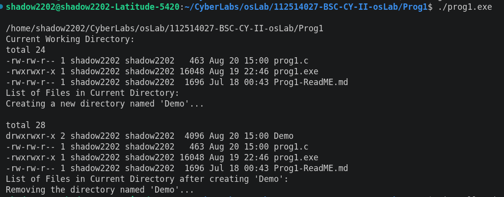

# Program 1: Simple System Terminal Commands in C

## Aim
To demonstrate the execution of basic Linux terminal commands from a C program using the `system()` function.

## Description
This program executes common Linux shell commands through the `system()` function to perform basic file and directory operations.

The commands executed are:

- `pwd` – Displays the current working directory.
- `ls -l` – Lists all files and directories in long format.
- `mkdir Demo` – Creates a new directory named **Demo**.
- `ls -l` – Displays the updated directory contents.
- `rmdir Demo` – Removes the empty **Demo** directory.

## Source Code
File: [prog1.c](https://github.com/sathyanarayanan-devs/112514027-BSC-CY-II-osLab/edit/112514027-BSC-OSLAB-CY-II/Prog1/prog1.c)

## Compilation

```bash
gcc prog1.c -o prog1
```

## Execution

```bash
./prog1
```

## Sample Output



## Commands Used

| Command | Purpose |
|---------|---------|
| `pwd` | Display current working directory |
| `ls -l` | List files and directories in long format |
| `mkdir Demo` | Create a directory named `Demo` |
| `rmdir Demo` | Remove the empty directory `Demo` |

## Result

The program successfully demonstrated the execution of Linux shell commands using the `system()` function in C, including directory creation, listing, and removal.
