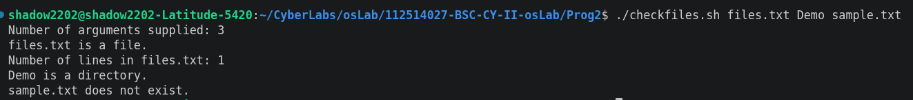

# Program 2: Shell Script to Check Files and Directories

## Aim
To write a shell script that accepts command-line arguments, determines whether each argument is a file or a directory, and displays the number of lines if the argument is a file.

## Description
This shell script processes each command-line argument provided by the user.

For every argument, it performs the following operations:

- Displays the total number of arguments supplied.
- Checks whether the argument is a file.
  - If it is a file, displays the number of lines in the file.
- Checks whether the argument is a directory.
  - If it is a directory, displays a corresponding message.
- If the argument is neither a valid file nor a directory, an appropriate error message is displayed.

## Source Code
File: `prog2.sh`

## Script

```bash
#!/bin/bash

echo "Number of arguments supplied: $#"

for item in "$@"
do
    if [ -f "$item" ]; then
        echo "$item is a file."
        lines=$(wc -l < "$item")
        echo "Number of lines in $item: $lines"
    elif [ -d "$item" ]; then
        echo "$item is a directory."
    else
        echo "$item is not a valid file or directory."
    fi
done
```

## Make the Script Executable

```bash
chmod +x prog2.sh
```

## Execution

```bash
./prog2.sh file1.txt Demo sample.txt
```

## Sample Output



## Commands Used

| Command | Purpose |
|---------|---------|
| `"$#"` | Displays the number of command-line arguments |
| `"$@"` | Iterates through all command-line arguments |
| `-f` | Checks whether an argument is a regular file |
| `-d` | Checks whether an argument is a directory |
| `wc -l` | Counts the number of lines in a file |

## Result

The shell script successfully accepted command-line arguments, identified whether each argument was a file or a directory, displayed the line count for files, and handled invalid inputs appropriately.