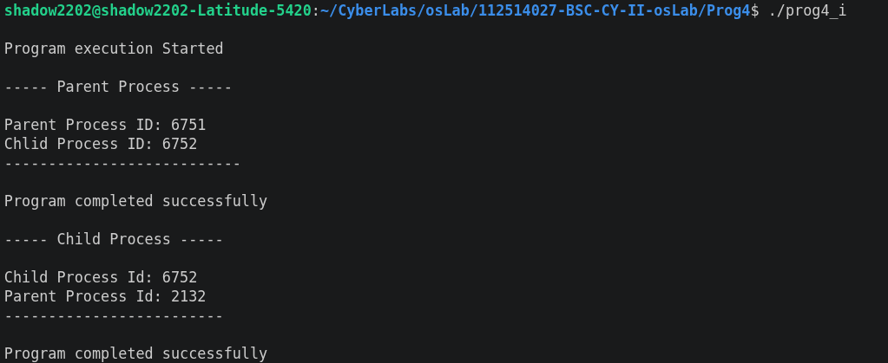
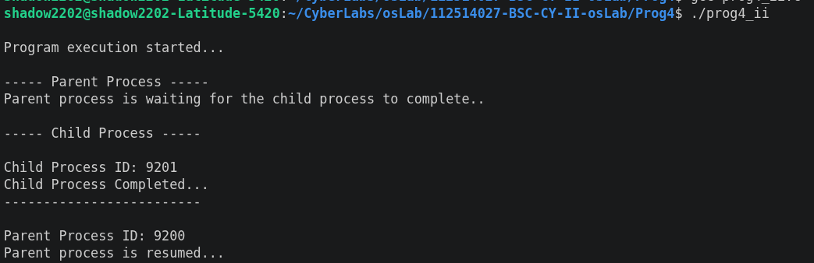

# Program 4: Process Creation and Management using Linux System Calls

## Aim

To demonstrate process creation using `fork()` and process synchronization using `wait()` in C.

## Description

This program demonstrates the creation of a child process using the `fork()` system call and the execution of parent and child processes.

The program consists of two parts:

- **`prog4_i.c`** – Demonstrates basic process creation using `fork()` and displays the process IDs of the parent and child processes.
- **`prog4_ii.c`** – Demonstrates process synchronization using `fork()` and `wait()`, where the parent process waits for the child process to complete.

The functions used are:

- `fork()` – Creates a new child process.
- `getpid()` – Returns the process ID of the current process.
- `getppid()` – Returns the process ID of the parent process.
- `wait()` – Makes the parent process wait for the child process.
- `sleep()` – Suspends the execution of the child process for a specified time.

## Source Code

**Files**:

- [prog4_i.c](https://github.com/sathyanarayanan-devs/112514027-BSC-CY-II-OSLAB/Prog4/prog4_i.c) – Process creation and process identification.
- [prog4_ii.c](https://github.com/sathyanarayanan-devs/112514027-BSC-CY-II-OSLAB/Prog4/prog4_ii.c) – Process creation with parent-child synchronization.

## Compilation

### Program 4(i)

```bash
gcc prog4_i.c -o prog4_i
```

### Program 4(ii)

```bash
gcc prog4_ii.c -o prog4_ii
```

## Execution

### Program 4(i)

```bash
./prog4_i
```

### Program 4(ii)

```bash
./prog4_ii
```

## Sample Output

### Program 4(i)



### Program 4(ii)



## Process Functions Used

| Function | Purpose |
|---------|---------|
| `fork()` | Creates a new child process |
| `getpid()` | Returns the process ID of the current process |
| `getppid()` | Returns the process ID of the parent process |
| `wait()` | Waits for the child process to complete |
| `sleep()` | Suspends the process for a specified time |

## Header Files Used

| Header File | Purpose |
|---------|---------|
| `<stdio.h>` | Standard input and output functions |
| `<unistd.h>` | Provides `fork()`, `getpid()`, `getppid()`, and `sleep()` |
| `<sys/wait.h>` | Provides the `wait()` function |

## Result

The program successfully demonstrated process creation using `fork()` and process identification using `getpid()` and `getppid()`. The second program also demonstrated process synchronization, where the parent process waits for the child process to complete using `wait()`.