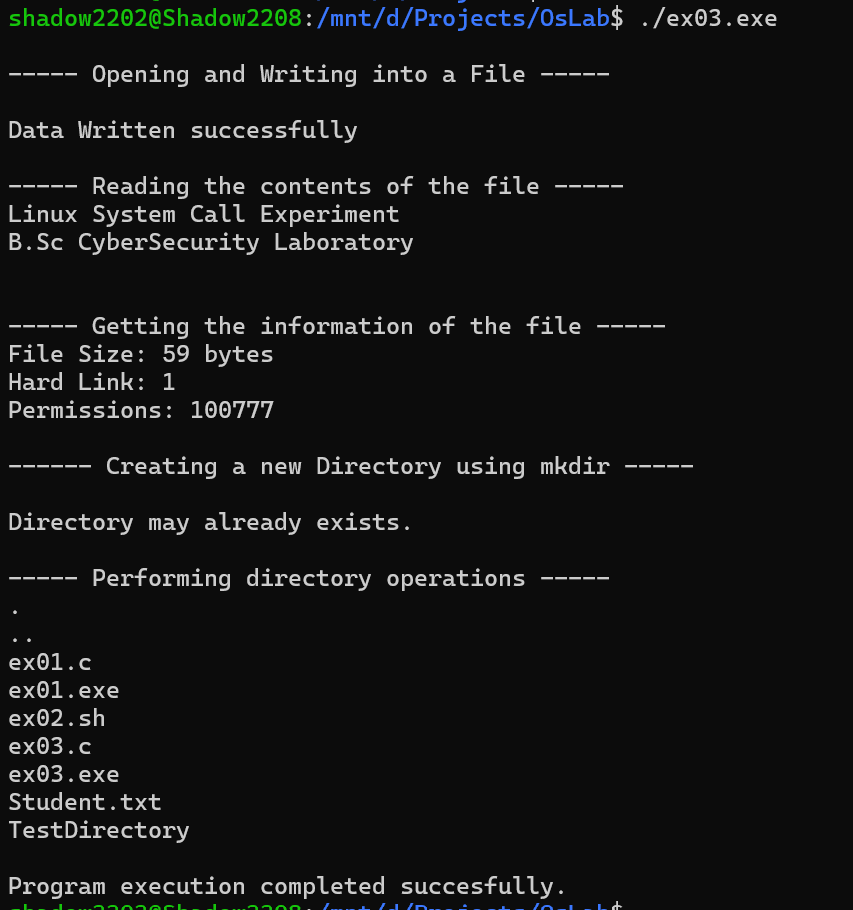

# Program 3: File and Directory Operations Using System Calls in C

## Aim

To demonstrate basic Linux file and directory operations in C using system calls and POSIX functions.

## Description

This program performs basic file and directory operations using C system calls and POSIX functions.

The operations performed are:

- `open()` – Creates and opens the file `Student.txt`.
- `write()` – Writes student laboratory information to the file.
- `read()` – Reads the contents of the file.
- `stat()` – Displays file size, number of links, and permissions.
- `mkdir()` – Creates a directory named **`TestDirectory`**.
- `opendir()` – Opens the current directory.
- `readdir()` – Displays the files and directories in the current directory.
- `close()` – Closes the opened file descriptor.

## Source Code

**File**: [prog3.c](https://github.com/sathyanarayanan-devs/112514027-BSC-CY-II-osLab/blob/112514027-BSC-OSLAB-CY-II/ex03/ex03.c)

## Compilation

```bash
gcc ex03.c -o ex03.exe
```

## Execution

```bash
./ex03.exe
```

## Sample Output



## System Calls / Functions Used

| Function | Purpose |
|---------|---------|
| `open()` | Create or open a file |
| `write()` | Write data to a file |
| `read()` | Read data from a file |
| `stat()` | Retrieve file information |
| `mkdir()` | Create a directory |
| `opendir()` | Open a directory |
| `readdir()` | Read directory entries |
| `close()` | Close an opened file |

## Result

The program successfully demonstrated basic Linux file and directory operations using system calls and POSIX functions in C, including file creation, writing, reading, file information retrieval, directory creation, and directory listing.