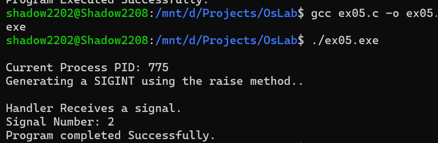

# Program 5: Signal Handling Using SIGINT in C

## Aim
To demonstrate signal handling in C using the `signal()` function and generate the `SIGINT` signal using the `raise()` function.

## Description
This program demonstrates how a process can handle signals using a signal handler.

The program:

- Displays the current process ID using `getpid()`.
- Registers a signal handler for the `SIGINT` signal using `signal()`.
- Generates the `SIGINT` signal using the `raise()` function.
- Displays the signal number when the signal is received.

## Source Code
**File**: [ex05.c](https://github.com/sathyanarayanan-devs/112514027-BSC-CY-II-osLab/blob/112514027-BSC-OSLAB-CY-II/ex05/ex05.c)

## Compilation

```bash
gcc ex05.c -o ex05.exe
```

## Execution

```bash
./ex05.exe
```

## Sample Output



## Functions Used

| Function | Purpose |
|---------|---------|
| `signal()` | Registers a signal handler |
| `raise()` | Generates a signal for the current process |
| `getpid()` | Returns the process ID |

## Signal Used

| Signal | Purpose |
|---------|---------|
| `SIGINT` | Interrupt signal, commonly generated using `Ctrl+C` |

## Result

The program successfully demonstrated signal handling in C using the `signal()` and `raise()` functions to handle the `SIGINT` signal.