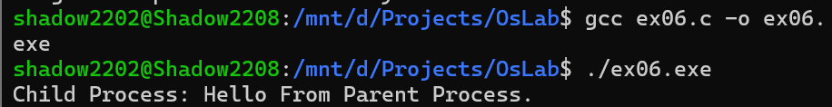

# Program 6: Inter-Process Communication Using Pipe

## Aim
To demonstrate inter-process communication between a parent process and a child process using an unnamed pipe in C.

## Description
This program demonstrates communication between a parent process and a child process using the `pipe()` and `fork()` system calls.

The program:

- Creates an unnamed pipe using the `pipe()` system call.
- Creates a child process using the `fork()` system call.
- The parent process writes a message into the pipe.
- The child process reads the message from the pipe.
- Displays the message received by the child process.
- Closes the unused read and write ends of the pipe.

## Source Code
**File**: https://github.com/sathyanarayanan-devs/112514027-BSC-CY-II-osLab/blob/112514027-BSC-OSLAB-CY-II/ex06/ex06.c

## Compilation

```bash
gcc ex06.c -o ex06.exe
```

## Execution

```bash
./ex06.exe
```

## Sample Output



## Functions Used

| Function | Purpose |
|---------|---------|
| `pipe()` | Creates an unnamed pipe for inter-process communication |
| `fork()` | Creates a child process |
| `read()` | Reads data from the pipe |
| `write()` | Writes data into the pipe |
| `close()` | Closes the read or write end of the pipe |
| `strlen()` | Determines the length of the message |

## Pipe File Descriptors

| Descriptor | Purpose |
|---------|---------|
| `fd[0]` | Read end of the pipe |
| `fd[1]` | Write end of the pipe |

## Process Communication

| Process | Operation |
|---------|---------|
| Parent Process | Writes `Hello from parent!` into the pipe |
| Child Process | Reads the message from the pipe and displays it |

## Result

The program successfully demonstrated inter-process communication between a parent process and a child process using an unnamed pipe in C.