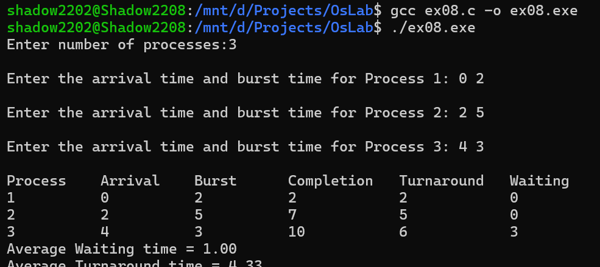

# Program 8: First Come First Serve (FCFS) CPU Scheduling

## Aim
To implement the First Come First Serve (FCFS) CPU scheduling algorithm in C and calculate the completion time, turnaround time, and waiting time for each process.

## Description
This program implements the FCFS CPU scheduling algorithm.

The program:

- Reads the number of processes.
- Accepts the arrival time and burst time of each process.
- Sorts the processes according to their arrival time.
- Executes the processes in First Come First Serve order.
- Handles CPU idle time when a process has not yet arrived.
- Calculates the completion time for each process.
- Calculates the turnaround time for each process.
- Calculates the waiting time for each process.
- Calculates the average turnaround time and average waiting time.

### Formulas Used

- **Completion Time** = Previous Completion Time + Burst Time
- **Turnaround Time** = Completion Time − Arrival Time
- **Waiting Time** = Turnaround Time − Burst Time

## Source Code
**File**: [ex08.c](https://github.com/sathyanarayanan-devs/112514027-BSC-CY-II-osLab/blob/112514027-BSC-OSLAB-CY-II/ex08/ex08.c)

## Compilation

```bash
gcc ex08.c -o ex08.exe
```

## Execution

```bash
./ex08.exe
```

## Sample Output



## Functions / Concepts Used

| Function / Concept | Purpose |
|---------|---------|
| `scanf()` | Reads process and scheduling information |
| `printf()` | Displays process details and calculated results |
| `bubble sort` | Sorts processes according to arrival time |
| FCFS Scheduling | Executes processes in arrival order |
| `struct Process` | Stores process scheduling information |

## Process Scheduling Parameters

| Parameter | Description |
|---------|---------|
| `id` | Identifies the process |
| `arrival_time` | Time at which the process arrives |
| `burst_time` | CPU time required by the process |
| `completion_time` | Time at which the process finishes |
| `turnaround_time` | Total time taken from arrival to completion |
| `waiting_time` | Time the process waits before execution |

## Result

The program successfully implemented the First Come First Serve (FCFS) CPU scheduling algorithm and calculated the completion time, turnaround time, waiting time, average turnaround time, and average waiting time for the given processes.