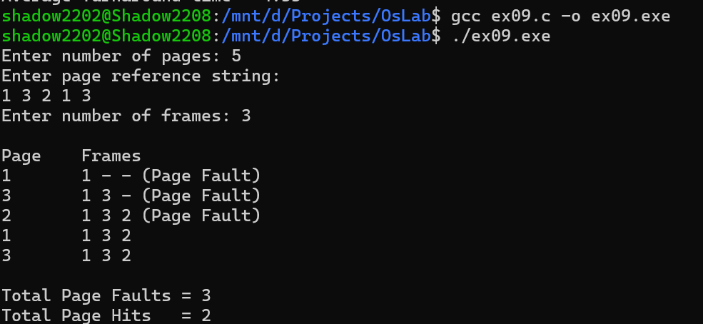

# Program 9: FIFO Page Replacement Algorithm

## Aim
To implement the First-In First-Out (FIFO) page replacement algorithm in C and calculate the total number of page faults and page hits.

## Description
This program implements the FIFO page replacement algorithm used in operating systems for memory management.

The program:

- Reads the number of pages in the reference string.
- Accepts the page reference string from the user.
- Reads the number of available frames.
- Initializes all frames as empty.
- Checks whether each referenced page is already present in the frames.
- If the page is present, it is considered a **page hit**.
- If the page is not present, it replaces the oldest page using the FIFO method and generates a **page fault**.
- Displays the contents of the frames after each page reference.
- Calculates and displays the total number of page faults and page hits.

## Source Code
**File**: [ex09.c](https://github.com/sathyanarayanan-devs/112514027-BSC-CY-II-osLab/blob/112514027-BSC-OSLAB-CY-II/ex09/ex09.c)

## Compilation

```bash
gcc ex09.c -o ex09.exe
```

## Execution

```bash
./ex09.exe
```

## Sample Output



## FIFO Page Replacement

| Term | Description |
|---------|---------|
| Page Reference String | Sequence of pages requested by the process |
| Frame | Memory location used to store a page |
| Page Fault | Occurs when the requested page is not present in memory |
| Page Hit | Occurs when the requested page is already present in memory |
| FIFO | Replaces the page that entered memory first |

## Functions / Concepts Used

| Function / Concept | Purpose |
|---------|---------|
| `scanf()` | Reads page and frame information |
| `printf()` | Displays page replacement results |
| `for` loop | Processes the page reference string |
| Array | Stores pages and memory frames |
| FIFO Algorithm | Replaces the oldest page in memory |

## Page Replacement Process

| Condition | Action |
|---------|---------|
| Page is already in a frame | Page Hit |
| Page is not in a frame | Page Fault |
| Empty frame is available | Page is placed in the empty frame |
| All frames are occupied | Oldest page is replaced |

## Result

The program successfully implemented the First-In First-Out (FIFO) page replacement algorithm and calculated the total number of page faults and page hits for the given page reference string.