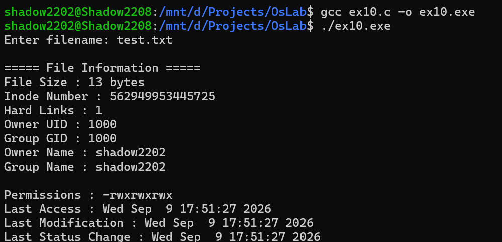

# Program 10: Display File Information Using stat()

## Aim
To retrieve and display detailed information about a file using the `stat()` system call and related functions in C.

## Description
This program accepts a filename from the user and retrieves detailed information about the specified file using the `stat()` system call.

The program displays:

- File size.
- Inode number.
- Number of hard links.
- Owner User ID (UID).
- Group ID (GID).
- Owner name.
- Group name.
- File permissions.
- Last access time.
- Last modification time.
- Last status change time.

## Source Code
**File**: [ex10.c](https://github.com/sathyanarayanan-devs/112514027-BSC-CY-II-osLab/blob/112514027-BSC-OSLAB-CY-II/ex10/ex10.c)

## Compilation

```bash
gcc ex10.c -o ex10.exe
```

## Execution

```bash
./ex10.exe
```

## Sample Output



## Functions Used

| Function | Purpose |
|---------|---------|
| `stat()` | Retrieves detailed information about a file |
| `getpwuid()` | Retrieves user information using the owner UID |
| `getgrgid()` | Retrieves group information using the GID |
| `ctime()` | Converts time values into a human-readable format |
| `perror()` | Displays an error message when an operation fails |
| `printf()` | Displays the file information |

## File Information Displayed

| Information | Purpose |
|---------|---------|
| File Size | Displays the size of the file in bytes |
| Inode Number | Displays the unique inode number of the file |
| Hard Links | Displays the number of hard links associated with the file |
| Owner UID | Displays the User ID of the file owner |
| Group GID | Displays the Group ID associated with the file |
| Owner Name | Displays the name of the file owner |
| Group Name | Displays the name of the associated group |
| File Permissions | Displays read, write, and execute permissions |
| Last Access Time | Displays when the file was last accessed |
| Last Modification Time | Displays when the file contents were last modified |
| Last Status Change Time | Displays when the file status was last changed |

## Result

The program successfully retrieved and displayed detailed information about a specified file using the `stat()` system call and related functions in C.